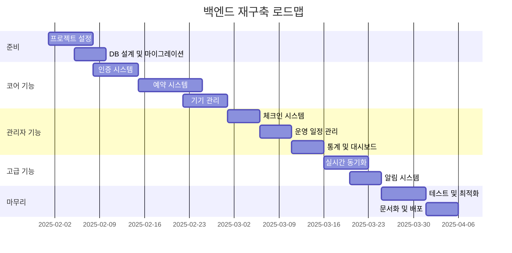

# 게임플라자 예약 시스템 백엔드 재구축 계획

## 📋 목차
1. [현재 프로젝트 분석](#1-현재-프로젝트-분석)
2. [새로운 백엔드 아키텍처 설계](#2-새로운-백엔드-아키텍처-설계)
3. [마이그레이션 전략](#3-마이그레이션-전략)
4. [GitHub 이슈 재구성](#4-github-이슈-재구성)
5. [개발 우선순위 및 로드맵](#5-개발-우선순위-및-로드맵)

---

## 1. 현재 프로젝트 분석

### 1.1 기술 스택 현황
- **프론트엔드**: Next.js 14, React, TypeScript, Tailwind CSS
- **백엔드**: 
  - Next.js API Routes (App Router)
  - Supabase (PostgreSQL + Realtime + Auth + Storage)
  - 일부 DDD 패턴 도입 시도 중
- **인증**: Google OAuth + Supabase Auth
- **배포**: Vercel

### 1.2 현재 백엔드 구조의 문제점
1. **Next.js API Routes의 한계**
   - 복잡한 비즈니스 로직 처리 어려움
   - 테스트 및 디버깅 복잡도 증가
   - 독립적인 백엔드 스케일링 불가

2. **아키텍처 일관성 부재**
   - DDD 패턴과 기존 코드 혼재
   - 명확한 계층 분리 부족
   - 의존성 관리 어려움

3. **Supabase 종속성**
   - 벤더 락인 우려
   - 복잡한 비즈니스 로직 구현 제한
   - 커스텀 기능 구현의 어려움

### 1.3 현재 API 엔드포인트 분석

#### 인증 관련
- `/api/auth/*` - Google OAuth, 세션 관리
- `/api/auth/phone/*` - 전화번호 인증 (SMS 제거됨)

#### 예약 시스템
- `/api/reservations/*` - 예약 CRUD
- `/api/available-machines/*` - 예약 가능 기기 조회
- `/api/rental-machines/*` - 대여 기기 관리

#### 관리자 기능
- `/api/admin/dashboard/*` - 대시보드 통계
- `/api/admin/reservations/*` - 예약 관리
- `/api/admin/devices/*` - 기기 관리
- `/api/admin/schedule/*` - 운영 일정 관리
- `/api/admin/checkin/*` - 체크인 처리

#### 기타
- `/api/cron/*` - 크론잡 (기기 상태 업데이트, 리마인더)
- `/api/notifications/*` - 푸시 알림
- `/api/public/*` - 공개 API

---

## 2. 새로운 백엔드 아키텍처 설계

### 2.1 기술 스택 선택

#### 옵션 비교

| 항목 | NestJS | Fastify + TypeScript | Express + TypeScript |
|------|--------|---------------------|---------------------|
| **성능** | ★★★★☆ | ★★★★★ | ★★★☆☆ |
| **개발 생산성** | ★★★★★ | ★★★☆☆ | ★★★★☆ |
| **생태계** | ★★★★★ | ★★★★☆ | ★★★★★ |
| **타입 안정성** | ★★★★★ | ★★★★☆ | ★★★★☆ |
| **학습 곡선** | ★★☆☆☆ | ★★★★☆ | ★★★★★ |
| **테스트 용이성** | ★★★★★ | ★★★★☆ | ★★★☆☆ |

#### 🎯 선택: NestJS
- **이유**:
  1. 강력한 DI(의존성 주입) 시스템
  2. 모듈화된 구조로 대규모 애플리케이션에 적합
  3. 우수한 TypeScript 지원
  4. 내장된 테스트 프레임워크
  5. 마이크로서비스 아키텍처 지원

### 2.2 데이터베이스 전략

#### 옵션 1: PostgreSQL 직접 사용 (권장) ✅
```
장점:
- Supabase에서 쉽게 마이그레이션 가능
- 기존 스키마 재사용
- 강력한 기능 (JSONB, 인덱싱, 트리거 등)
- TypeORM/Prisma와 완벽 호환

단점:
- 실시간 기능 별도 구현 필요
- 관리 복잡도 증가
```

#### 옵션 2: Supabase 클라이언트 유지
```
장점:
- 실시간 기능 그대로 사용
- 마이그레이션 최소화
- 관리 편의성

단점:
- 여전한 벤더 종속성
- 커스텀 쿼리 제한
```

#### 🎯 하이브리드 접근법
1. **1단계**: Supabase 클라이언트로 시작
2. **2단계**: 점진적으로 직접 DB 연결로 전환
3. **3단계**: 실시간 기능만 Supabase Realtime 유지 또는 Socket.io로 대체

### 2.3 인증 시스템

#### 옵션 비교
| 방식 | 장점 | 단점 |
|------|------|------|
| **Passport.js** | 다양한 전략, 커뮤니티 | 설정 복잡 |
| **자체 JWT** | 완전한 제어, 가벼움 | 구현 복잡도 |
| **Auth0** | 관리 편의성, 보안 | 비용, 종속성 |
| **Supabase Auth 유지** | 마이그레이션 최소화 | 종속성 지속 |

#### 🎯 선택: Passport.js + JWT
- Google OAuth는 Passport.js로 처리
- JWT 토큰 기반 인증
- Refresh Token 전략 구현

### 2.4 실시간 기능 구현

#### 🎯 Socket.io 도입
```typescript
// 실시간 이벤트 구조
- reservation:created
- reservation:updated
- device:statusChanged
- checkin:requested
- payment:confirmed
```

### 2.5 새로운 프로젝트 구조

```
gameplaza-backend/
├── src/
│   ├── modules/           # 기능별 모듈
│   │   ├── auth/         # 인증/인가
│   │   ├── users/        # 사용자 관리
│   │   ├── reservations/ # 예약 시스템
│   │   ├── devices/      # 기기 관리
│   │   ├── schedule/     # 운영 일정
│   │   ├── analytics/    # 통계/분석
│   │   └── notifications/# 알림
│   ├── common/           # 공통 모듈
│   │   ├── decorators/   # 커스텀 데코레이터
│   │   ├── filters/      # 예외 필터
│   │   ├── guards/       # 가드 (인증/인가)
│   │   ├── interceptors/ # 인터셉터
│   │   └── pipes/        # 파이프 (검증/변환)
│   ├── config/           # 설정
│   ├── database/         # DB 설정 및 마이그레이션
│   └── main.ts          # 진입점
├── test/                # 테스트
├── docker-compose.yml   # 로컬 개발 환경
└── package.json
```

---

## 3. 마이그레이션 전략

### 3.1 단계별 전환 계획

#### Phase 1: 준비 단계 (1주)
1. NestJS 프로젝트 초기 설정
2. 기존 DB 스키마 분석 및 Entity 생성
3. 기본 모듈 구조 설정
4. 개발 환경 구축 (Docker, PostgreSQL)

#### Phase 2: 코어 기능 마이그레이션 (2-3주)
1. **인증 시스템**
   - Google OAuth 구현
   - JWT 토큰 관리
   - 세션 마이그레이션

2. **사용자 관리**
   - User CRUD
   - 권한 관리 (RBAC)

3. **예약 시스템 핵심**
   - 예약 생성/조회/수정/취소
   - 24시간 룰 로직
   - KST 시간대 처리

#### Phase 3: 관리자 기능 마이그레이션 (2주)
1. **기기 관리**
   - 기기 CRUD
   - 상태 관리
   - 카테고리/기종 관리

2. **체크인 시스템**
   - 체크인 프로세스
   - 결제 확인
   - 시간/금액 조정

3. **운영 일정**
   - 스케줄 관리
   - 자동 스케줄 생성

#### Phase 4: 고급 기능 구현 (1-2주)
1. **실시간 기능**
   - Socket.io 통합
   - 실시간 알림
   - 기기 상태 동기화

2. **통계 및 분석**
   - 대시보드 API
   - 리포트 생성

3. **알림 시스템**
   - FCM 푸시 알림
   - 이메일 알림

#### Phase 5: 전환 및 최적화 (1주)
1. API Gateway 설정 (점진적 라우팅)
2. 성능 최적화
3. 로드 테스트
4. 문서화

### 3.2 데이터 마이그레이션

```typescript
// 마이그레이션 스크립트 예시
export class DataMigrationService {
  async migrateUsers() {
    // 1. Supabase에서 데이터 읽기
    const users = await supabase.from('users').select('*');
    
    // 2. 새 DB에 삽입
    await this.userRepository.createMany(users.data);
  }

  async migrateReservations() {
    // 배치 처리로 대용량 데이터 마이그레이션
    const batchSize = 1000;
    let offset = 0;
    
    while (true) {
      const { data } = await supabase
        .from('reservations')
        .select('*')
        .range(offset, offset + batchSize - 1);
        
      if (!data.length) break;
      
      await this.reservationRepository.createMany(data);
      offset += batchSize;
    }
  }
}
```

### 3.3 API 버전 관리

```
현재: https://api.gameplaza.com/reservations
신규: https://api.gameplaza.com/v2/reservations

또는

프록시를 통한 점진적 마이그레이션:
- 80% 기존 API
- 20% 새 API (A/B 테스트)
```

---

## 4. GitHub 이슈 재구성

### 4.1 기존 DDD 관련 이슈 정리

현재 DDD 마일스톤 이슈들을 다음과 같이 재구성:

1. **닫을 이슈** (DDD 관련)
   - #60~#69: DDD 아키텍처 전환 관련
   - 종료 사유: "백엔드 재구축으로 방향 전환"

2. **유지할 이슈** (기능 구현)
   - #54~#57: 시간대/예약 시스템
   - #51~#53: 이용안내 페이지
   - #39~#50: 테스트/배포/문서화

### 4.2 새로운 이슈 생성

#### 🏗️ 인프라 및 설정
```markdown
- [ ] NestJS 프로젝트 초기 설정
- [ ] Docker 개발 환경 구축
- [ ] PostgreSQL 직접 연결 설정
- [ ] TypeORM/Prisma 설정
- [ ] CI/CD 파이프라인 구축
```

#### 🔐 인증/인가
```markdown
- [ ] Passport.js Google OAuth 구현
- [ ] JWT 토큰 관리 시스템
- [ ] RBAC 권한 시스템 구현
- [ ] 세션 마이그레이션 전략
```

#### 📅 예약 시스템
```markdown
- [ ] 예약 모듈 구현 (CRUD)
- [ ] 24시간 룰 비즈니스 로직
- [ ] KST 시간대 처리 유틸리티
- [ ] 예약 가능성 검증 로직
```

#### 🎮 기기 관리
```markdown
- [ ] 기기 모듈 구현
- [ ] 카테고리/기종 관리
- [ ] 기기 상태 관리 시스템
- [ ] 대여 설정 관리
```

#### ✅ 체크인 시스템
```markdown
- [ ] 체크인 프로세스 구현
- [ ] 결제 확인 워크플로우
- [ ] 시간/금액 조정 기능
```

#### 📊 통계 및 모니터링
```markdown
- [ ] 대시보드 API 구현
- [ ] 실시간 통계 집계
- [ ] 로깅 및 모니터링 설정
```

#### 🔄 실시간 기능
```markdown
- [ ] Socket.io 통합
- [ ] 실시간 이벤트 시스템
- [ ] 클라이언트 동기화 로직
```

#### 🧪 테스트
```markdown
- [ ] 단위 테스트 작성
- [ ] 통합 테스트 구현
- [ ] E2E 테스트 시나리오
- [ ] 부하 테스트
```

### 4.3 새로운 마일스톤 설정

1. **Backend Foundation** (2주)
   - 기본 인프라 및 코어 모듈

2. **Core Features** (3주)
   - 인증, 예약, 기기 관리

3. **Admin Features** (2주)
   - 관리자 기능 및 통계

4. **Advanced Features** (2주)
   - 실시간, 알림, 최적화

5. **Production Ready** (1주)
   - 테스트, 문서화, 배포

---

## 5. 개발 우선순위 및 로드맵

### 5.1 우선순위 매트릭스

| 기능 | 중요도 | 긴급도 | 우선순위 |
|------|--------|--------|----------|
| 인증 시스템 | ⭐⭐⭐⭐⭐ | ⭐⭐⭐⭐⭐ | P0 |
| 예약 CRUD | ⭐⭐⭐⭐⭐ | ⭐⭐⭐⭐⭐ | P0 |
| 기기 관리 | ⭐⭐⭐⭐⭐ | ⭐⭐⭐⭐ | P0 |
| 체크인 시스템 | ⭐⭐⭐⭐ | ⭐⭐⭐⭐ | P1 |
| 실시간 동기화 | ⭐⭐⭐⭐ | ⭐⭐⭐ | P1 |
| 통계/분석 | ⭐⭐⭐ | ⭐⭐ | P2 |
| 알림 시스템 | ⭐⭐⭐ | ⭐⭐⭐ | P2 |

### 5.2 10주 로드맵



### 5.3 프론트엔드 연동 전략

1. **API 계약 우선 정의**
   - OpenAPI 3.0 스펙 작성
   - Mock 서버 제공
   - 타입 자동 생성

2. **점진적 마이그레이션**
   ```typescript
   // 프론트엔드 API 클라이언트
   class ApiClient {
     async getReservations() {
       if (featureFlags.useNewBackend) {
         return this.newApi.get('/v2/reservations');
       }
       return this.oldApi.get('/api/reservations');
     }
   }
   ```

3. **하위 호환성 유지**
   - 기존 API 응답 형식 유지
   - 필드 추가는 가능, 제거는 신중히
   - Deprecation 정책 수립

### 5.4 리스크 관리

| 리스크 | 영향도 | 대응 방안 |
|--------|--------|-----------|
| 데이터 마이그레이션 실패 | 높음 | 롤백 전략, 백업 |
| 성능 저하 | 중간 | 캐싱, 쿼리 최적화 |
| 보안 취약점 | 높음 | 보안 감사, 펜테스트 |
| 프론트엔드 호환성 | 중간 | API 버저닝, 테스트 |

### 5.5 성공 지표

1. **성능 지표**
   - API 응답 시간 < 200ms (P95)
   - 동시 접속 1000명 처리
   - 가동률 99.9%

2. **품질 지표**
   - 테스트 커버리지 > 80%
   - 중대 버그 0건
   - 보안 취약점 0건

3. **개발 지표**
   - 일정 준수율 > 90%
   - 기술 부채 감소
   - 문서화 완성도 100%

---

## 📌 다음 단계

1. **즉시 실행**
   - [ ] 이 계획서 리뷰 및 승인
   - [ ] NestJS 프로젝트 생성
   - [ ] 팀 구성 및 역할 분담

2. **1주차 목표**
   - [ ] 개발 환경 구축 완료
   - [ ] DB 스키마 분석 완료
   - [ ] 첫 번째 API 엔드포인트 구현

3. **의사결정 필요 사항**
   - [ ] 호스팅 플랫폼 선택 (AWS/GCP/자체 서버)
   - [ ] 모니터링 도구 선택
   - [ ] 백업 전략 수립

---

**작성일**: 2025-07-23  
**작성자**: Claude Code Assistant  
**버전**: 1.0