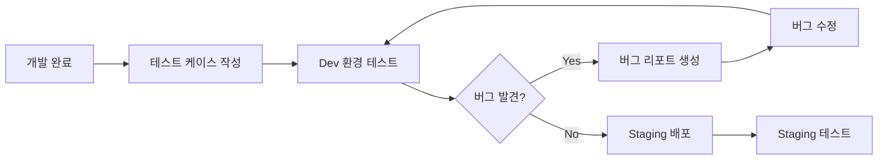
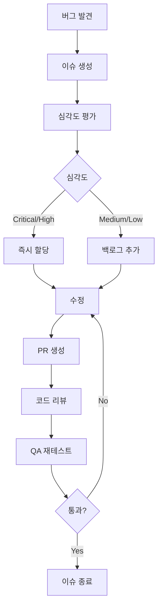

# 게임플라자 QA 워크플로우 가이드

## 📋 목차
- [개요](#개요)
- [QA 이슈 유형](#qa-이슈-유형)
- [이슈 생성 가이드](#이슈-생성-가이드)
- [QA 프로세스](#qa-프로세스)
- [프로젝트 보드 활용](#프로젝트-보드-활용)
- [자동화 도구](#자동화-도구)

## 개요

이 문서는 게임플라자 프로젝트의 QA 이슈 관리 방법을 설명합니다. GitHub Issues와 Projects를 활용하여 체계적으로 QA를 진행합니다.

## QA 이슈 유형

### 1. 🐛 버그 리포트 (Bug Report)
- **용도**: QA 테스트 중 발견된 버그 보고
- **템플릿**: `.github/ISSUE_TEMPLATE/qa-bug-report.yml`
- **라벨**: `qa`, `bug`, `qa:severity-level`

### 2. 📋 테스트 케이스 (Test Case)
- **용도**: 새 기능에 대한 테스트 시나리오 작성
- **템플릿**: `.github/ISSUE_TEMPLATE/qa-test-case.yml`
- **라벨**: `qa`, `test-case`, `documentation`

### 3. 🔄 회귀 테스트 (Regression Test)
- **용도**: 릴리즈 전 전체 기능 검증
- **템플릿**: `.github/ISSUE_TEMPLATE/qa-regression.yml`
- **라벨**: `qa`, `regression`, `release`

## 이슈 생성 가이드

### 버그 리포트 작성 예시

```bash
# GitHub CLI 사용
gh issue create \
  --title "[QA-BUG] 예약 시간 선택 시 24시간 표시 오류" \
  --label "qa,bug,qa:high" \
  --assignee "@qa-team" \
  --body "템플릿에 따라 작성"

# 또는 웹에서 직접 생성
# https://github.com/[owner]/gameplaza-v2/issues/new?template=qa-bug-report.yml
```

### 필수 정보

1. **제목 형식**: `[QA-타입] 간결한 설명`
   - `[QA-BUG]` - 버그
   - `[QA-TC]` - 테스트 케이스
   - `[QA-REG]` - 회귀 테스트

2. **심각도 분류**:
   - 🔴 **Critical**: 서비스 이용 불가
   - 🟠 **High**: 주요 기능 오류
   - 🟡 **Medium**: 일부 기능 오류
   - 🟢 **Low**: 사소한 오류

3. **필수 포함 정보**:
   - 재현 단계
   - 예상 동작 vs 실제 동작
   - 테스트 환경 (기기, 브라우저)
   - 스크린샷/동영상

## QA 프로세스

### 1. 기능 개발 완료 시


### 2. 버그 처리 플로우


### 3. 릴리즈 전 체크리스트
- [ ] 모든 Critical/High 버그 해결
- [ ] 회귀 테스트 체크리스트 100% 완료
- [ ] 성능 테스트 통과
- [ ] 보안 취약점 스캔 완료
- [ ] 모바일 디바이스 테스트 완료

## 프로젝트 보드 활용

### 보드 구조
```
📊 QA Dashboard
├── 📥 Backlog (대기 중)
├── 🔍 In Testing (테스트 중)
├── 🐛 Bug Found (버그 발견)
├── 🔧 In Fix (수정 중)
├── ✅ Resolved (해결됨)
└── 🚢 Shipped (배포됨)
```

### 커스텀 필드 활용
- **Severity**: Critical / High / Medium / Low
- **Environment**: Production / Staging / Development / Local
- **Test Status**: Not Started / In Progress / Passed / Failed / Blocked
- **Device Type**: Mobile / Desktop / Tablet
- **Browser**: Chrome / Safari / Firefox / Edge

### 뷰(View) 활용
1. **By Severity**: 심각도별 그룹핑
2. **By Test Status**: 테스트 상태별 그룹핑
3. **By Assignee**: 담당자별 그룹핑
4. **Sprint View**: 스프린트별 필터링

## 자동화 도구

### 1. GitHub Actions 연동
```yaml
# .github/workflows/qa-automation.yml
name: QA Automation

on:
  issues:
    types: [opened, labeled]

jobs:
  auto-assign:
    if: contains(github.event.label.name, 'qa:critical')
    runs-on: ubuntu-latest
    steps:
      - name: Auto assign to QA lead
        uses: actions/github-script@v6
        with:
          script: |
            github.rest.issues.addAssignees({
              owner: context.repo.owner,
              repo: context.repo.repo,
              issue_number: context.issue.number,
              assignees: ['qa-lead-username']
            })
```

### 2. 일일 QA 리포트
```bash
#!/bin/bash
# scripts/generate-qa-report.sh

echo "# QA 일일 리포트 - $(date +%Y-%m-%d)"
echo ""
echo "## 📊 현황"
gh issue list --label "qa" --state open --json state,title,labels | jq -r '.[] | "- [\(.state)] \(.title)"'

echo ""
echo "## 🔴 Critical 이슈"
gh issue list --label "qa:critical" --state open --json number,title,assignee | jq -r '.[] | "- #\(.number) \(.title) (@\(.assignee.login // "미할당"))"'

echo ""
echo "## 📈 통계"
echo "- 오픈 이슈: $(gh issue list --label "qa" --state open --json number | jq length)"
echo "- 오늘 해결: $(gh issue list --label "qa" --state closed --search "closed:>=$(date +%Y-%m-%d)" --json number | jq length)"
```

### 3. 슬랙 연동 (선택사항)
```javascript
// scripts/slack-qa-notifier.js
const { WebClient } = require('@slack/web-api');
const { Octokit } = require('@octokit/rest');

// Critical 버그 발견 시 슬랙 알림
async function notifyCriticalBug(issue) {
  const slack = new WebClient(process.env.SLACK_TOKEN);
  
  await slack.chat.postMessage({
    channel: '#qa-alerts',
    text: `🚨 Critical 버그 발견!`,
    blocks: [{
      type: 'section',
      text: {
        type: 'mrkdwn',
        text: `*${issue.title}*\n${issue.html_url}\n담당자: ${issue.assignee?.login || '미지정'}`
      }
    }]
  });
}
```

## 모범 사례

### ✅ DO
- 구체적이고 명확한 제목 작성
- 재현 가능한 단계 상세히 기록
- 스크린샷/동영상 적극 활용
- 관련 이슈 링크 연결
- 테스트 환경 정확히 명시

### ❌ DON'T
- 모호한 설명 ("작동 안 됨", "이상함")
- 여러 버그를 하나의 이슈에 포함
- 재현 단계 없이 결과만 보고
- 중복 이슈 생성 (검색 먼저!)
- 개인정보 포함된 스크린샷 첨부

## 팀 협업 가이드

### 역할과 책임
- **QA 엔지니어**: 테스트 실행, 버그 리포트 작성
- **개발자**: 버그 수정, 수정 내용 설명
- **PM**: 우선순위 결정, 릴리즈 승인
- **디자이너**: UI/UX 이슈 검토

### 커뮤니케이션
- 모든 논의는 이슈 코멘트에 기록
- 상태 변경 시 이유 명시
- 블로킹 이슈는 즉시 에스컬레이션

## 유용한 명령어

```bash
# 오픈된 QA 이슈 조회
gh issue list --label "qa" --state open

# 나에게 할당된 QA 이슈
gh issue list --label "qa" --assignee @me

# Critical 버그만 조회
gh issue list --label "qa:critical" --state open

# 이번 주 해결된 QA 이슈
gh issue list --label "qa" --state closed --search "closed:>=2024-01-01"

# QA 보드 열기
gh project list
```

## 참고 자료
- [GitHub Issues 문서](https://docs.github.com/en/issues)
- [GitHub Projects 문서](https://docs.github.com/en/issues/planning-and-tracking-with-projects)
- [GitHub CLI 문서](https://cli.github.com/manual/)