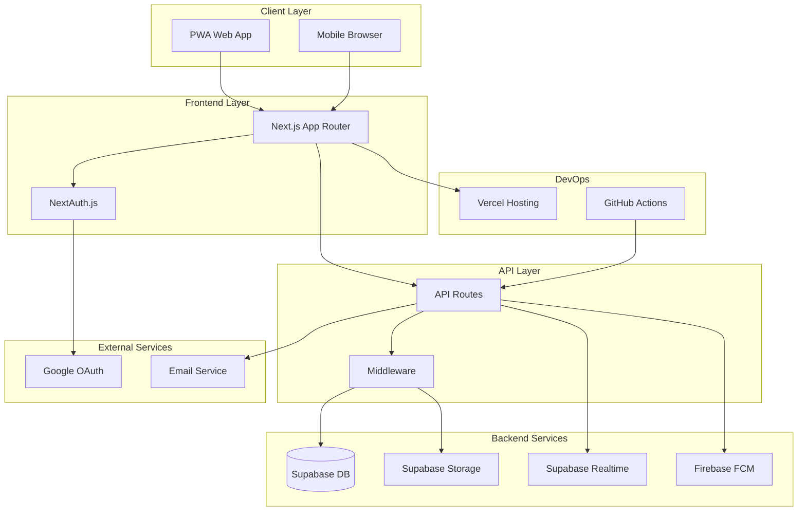
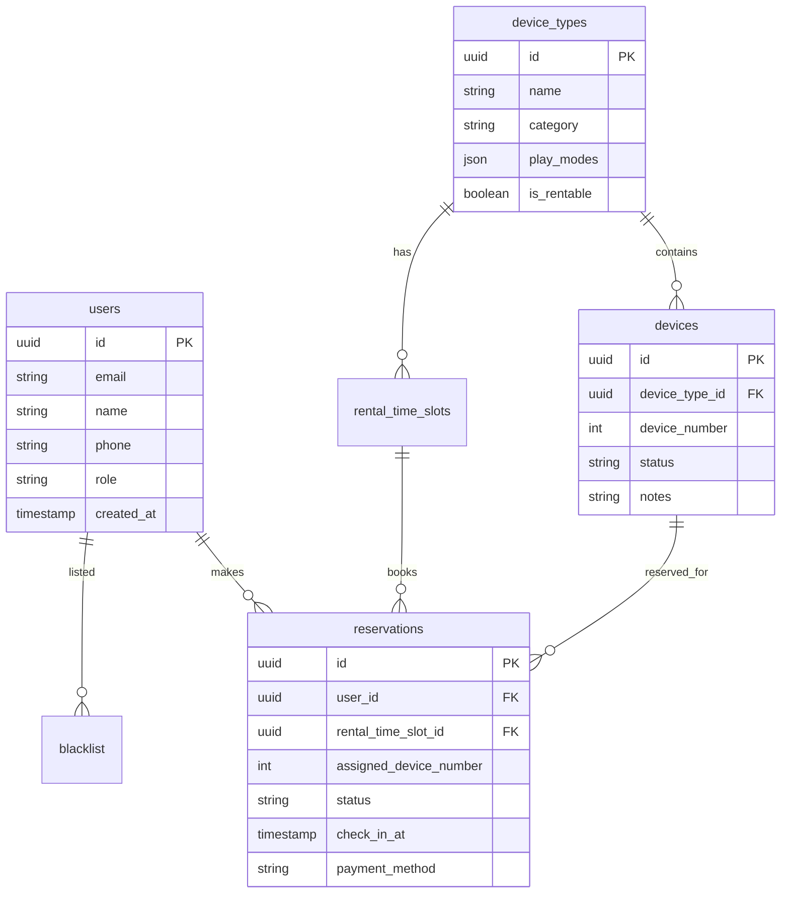

# 🏗️ 프로젝트 아키텍처 문서

## 📐 시스템 아키텍처 개요



## 🎯 아키텍처 원칙

### 1. **모듈화 (Modularity)**
- 기능별로 독립적인 모듈 구성
- 느슨한 결합(Loose Coupling)
- 높은 응집도(High Cohesion)

### 2. **확장성 (Scalability)**
- 수평적 확장 가능한 구조
- 마이크로서비스로의 전환 고려
- 캐싱 전략 적용

### 3. **보안 우선 (Security First)**
- 모든 레이어에서 보안 검증
- 최소 권한 원칙
- 데이터 암호화

### 4. **성능 최적화 (Performance)**
- 클라이언트 사이드 캐싱
- 서버 사이드 렌더링
- 이미지 최적화

## 📁 프로젝트 구조

```
gameplaza-v2/
├── app/                        # Next.js App Router
│   ├── (auth)/                # 인증 관련 페이지
│   │   ├── login/            # 로그인
│   │   └── signup/           # 회원가입
│   ├── admin/                 # 관리자 영역
│   │   ├── checkin/          # 체크인 관리
│   │   ├── devices/          # 기기 관리
│   │   ├── reservations/     # 예약 관리
│   │   └── analytics/        # 통계 분석
│   ├── api/                   # API 엔드포인트
│   │   ├── auth/             # 인증 API
│   │   ├── admin/            # 관리자 API
│   │   ├── reservations/     # 예약 API
│   │   └── cron/             # 크론잡 API
│   ├── components/            # 공통 컴포넌트
│   │   ├── Navigation.tsx    # 네비게이션
│   │   ├── ThemeToggle.tsx   # 다크모드 토글
│   │   └── LoadingSpinner.tsx
│   ├── reservations/          # 예약 페이지
│   │   ├── new/              # 새 예약
│   │   └── [id]/             # 예약 상세
│   └── layout.tsx             # 루트 레이아웃
├── hooks/                     # Custom React Hooks
│   ├── useAuth.ts            # 인증 훅
│   ├── useReservation.ts     # 예약 관리 훅
│   └── useSupabase.ts        # Supabase 연동 훅
├── lib/                       # 유틸리티 함수
│   ├── api/                  # API 클라이언트
│   │   ├── reservations.ts   # 예약 API
│   │   └── devices.ts        # 기기 API
│   ├── supabase/             # Supabase 설정
│   │   ├── client.ts         # 클라이언트 설정
│   │   └── middleware.ts     # 미들웨어
│   └── utils/                # 헬퍼 함수
├── types/                     # TypeScript 타입
│   ├── database.types.ts     # DB 스키마 타입
│   ├── api.types.ts          # API 타입
│   └── index.ts              # 공통 타입
├── supabase/                  # Supabase 설정
│   └── migrations/           # DB 마이그레이션
└── middleware.ts              # Next.js 미들웨어
```

## 🔄 데이터 플로우

### 1. **예약 신청 플로우**
```
사용자 입력
    ↓
클라이언트 검증
    ↓
API Route 호출
    ↓
미들웨어 인증 확인
    ↓
비즈니스 로직 처리
    ↓
Supabase DB 저장
    ↓
실시간 업데이트 (Realtime)
    ↓
FCM 푸시 알림
    ↓
클라이언트 상태 업데이트
```

### 2. **인증 플로우**
```
구글 로그인 클릭
    ↓
Google OAuth 리다이렉트
    ↓
콜백 처리 (NextAuth)
    ↓
세션 생성
    ↓
회원가입 정보 입력 (닉네임, 전화번호)
    ↓
사용자 정보 DB 저장
```

## 🛡️ 보안 아키텍처

### 레이어별 보안 전략

1. **클라이언트 레이어**
   - XSS 방지: React 자동 이스케이프
   - HTTPS 강제
   - 민감한 정보 노출 방지

2. **API 레이어**
   - JWT 토큰 검증
   - Rate Limiting
   - CORS 설정
   - Input Validation

3. **데이터베이스 레이어**
   - Row Level Security (RLS)
   - 역할 기반 접근 제어
   - 데이터 암호화

## 💾 데이터베이스 설계

### 주요 테이블 관계도



## 🚀 배포 아키텍처

### CI/CD 파이프라인

```
GitHub Push
    ↓
GitHub Actions 트리거
    ↓
테스트 실행
    ↓
빌드 검증
    ↓
Vercel 자동 배포
    ↓
프리뷰 URL 생성
    ↓
프로덕션 배포 (main 브랜치)
```

### 환경 구성

- **개발**: localhost:3000
- **스테이징**: preview-*.vercel.app
- **프로덕션**: gameplaza.vercel.app

## 📊 성능 아키텍처

### 캐싱 전략

1. **브라우저 캐싱**
   - 정적 자산: 1년
   - API 응답: 조건부 캐싱

2. **CDN 캐싱**
   - Vercel Edge Network
   - 이미지 최적화

3. **애플리케이션 캐싱**
   - React Query 캐시
   - 낙관적 업데이트

### 최적화 기법

- **코드 분할**: 라우트별 자동 분할
- **이미지 최적화**: WebP 자동 변환
- **번들 최적화**: Tree Shaking
- **지연 로딩**: Intersection Observer

## 🔌 통합 포인트

### 외부 서비스 연동

1. **Google OAuth**
   - 로그인/회원가입
   - 프로필 정보 동기화

2. **Firebase FCM**
   - 푸시 알림

3. **Supabase**
   - 데이터베이스
   - 실시간 동기화
   - 파일 스토리지

### API 통합 패턴

```typescript
// API 클라이언트 예시
class APIClient {
  private async request(endpoint: string, options?: RequestInit) {
    const response = await fetch(`/api${endpoint}`, {
      ...options,
      headers: {
        'Content-Type': 'application/json',
        ...options?.headers,
      },
    });
    
    if (!response.ok) {
      throw new APIError(response.status, await response.text());
    }
    
    return response.json();
  }
  
  // 사용 예시
  async createReservation(data: ReservationData) {
    return this.request('/reservations', {
      method: 'POST',
      body: JSON.stringify(data),
    });
  }
}
```

## 🔮 확장 계획

### 단기 (3개월)
- 캐싱 레이어 추가 (Redis)
- 이미지 CDN 분리
- 로깅 시스템 구축

### 중기 (6개월)
- 마이크로서비스 분리
- GraphQL API 도입
- 네이티브 앱 개발

### 장기 (12개월)
- 다중 지점 지원
- AI 기반 예약 추천
- 블록체인 결제 연동

## 📝 아키텍처 결정 기록 (ADR)

### ADR-001: Next.js App Router 채택
- **날짜**: 2024-01-01
- **상태**: 승인됨
- **맥락**: 서버 컴포넌트의 이점 활용
- **결정**: Pages Router 대신 App Router 사용
- **결과**: 더 나은 성능과 개발 경험

### ADR-002: Supabase 선택
- **날짜**: 2024-01-05
- **상태**: 승인됨
- **맥락**: Firebase 대안 검토
- **결정**: 오픈소스이며 PostgreSQL 기반인 Supabase 선택
- **결과**: 더 유연한 쿼리와 비용 절감

### ADR-003: GitHub Actions 크론잡
- **날짜**: 2024-01-15
- **상태**: 승인됨
- **맥락**: 서버리스 크론잡 필요
- **결정**: Vercel Cron 대신 GitHub Actions 사용
- **결과**: 완전 무료로 크론잡 구현

---

이 문서는 프로젝트의 성장과 함께 지속적으로 업데이트됩니다.